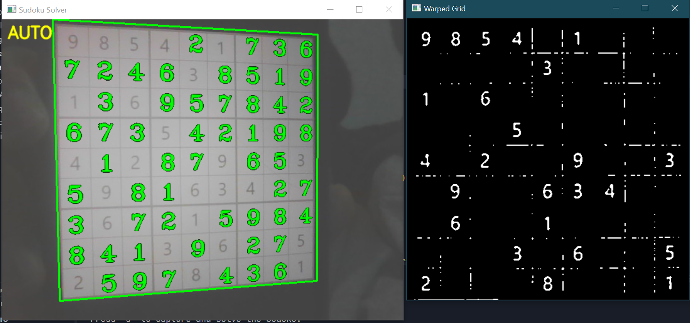
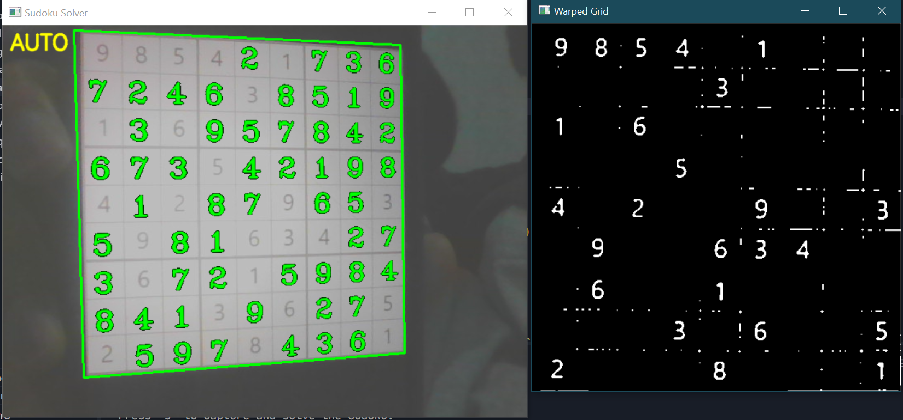
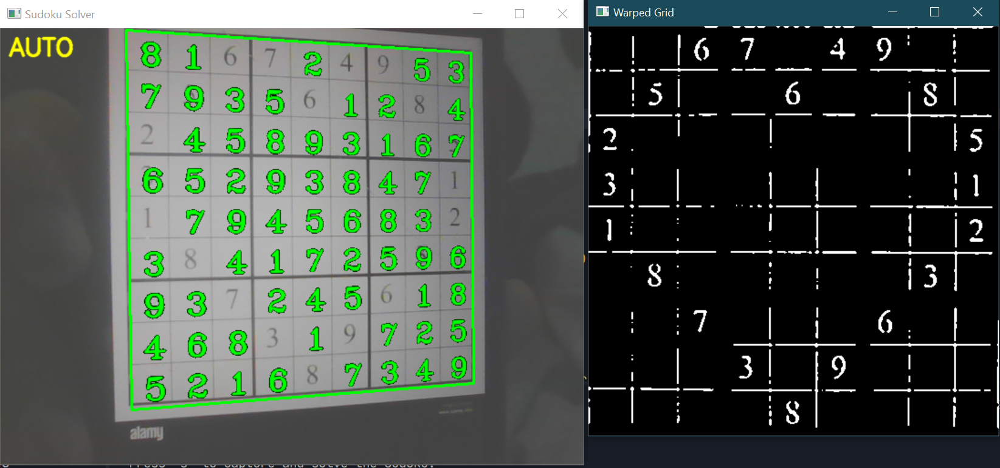
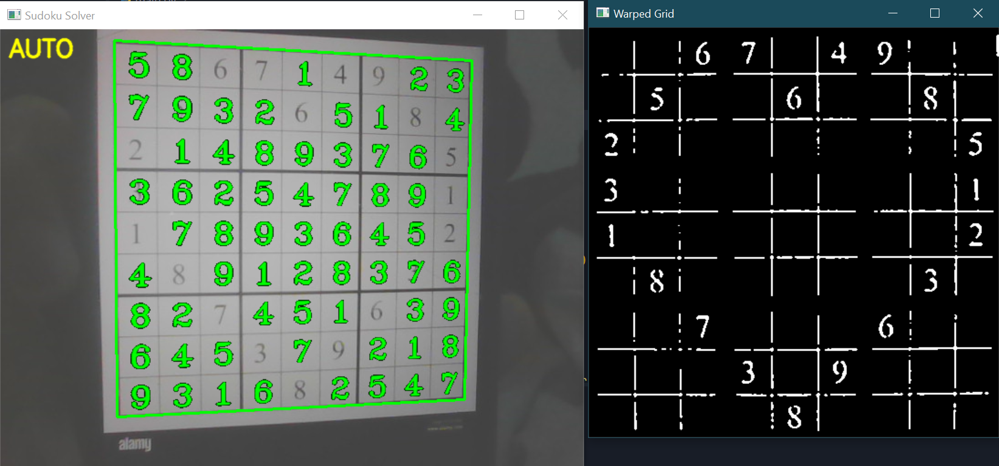

# Sudoku Solver (Webcam + Real-Time AR Overlay)

This project detects a Sudoku puzzle from a webcam (or an image), reads the digits, solves the puzzle, and overlays the solution back onto the original view (AR style).

## Screenshots

| Detected Grid | Solved Overlay |
|:---:|:---:|
|  |  |
| **Warped View** | **Real-Time AR** |
|  |  |

It is not hardcoded to any puzzle: it solves whatever valid Sudoku is detected.

## What This Project Does

1. Capture frames from a webcam (or load an image).
2. Detect the largest 4-corner contour (the Sudoku grid).
3. Warp the grid into a top-down view.
4. Preprocess the warped grid for OCR (threshold + grid-line removal).
5. Split the grid into 81 cell images.
6. Recognize digits with a CNN (`model.h5`) and build a 9x9 board.
7. Validate and solve the board using backtracking.
8. Warp the solution overlay back into the camera frame.

## Repository Files (Quick Tour)

- [main.py]: Main entry point (webcam loop, auto-solve, overlay).
- [image_processor.py]: Grid detection, warping, OCR preprocessing, cell split, overlay drawing.
- [digit_recognizer.py]: Loads `model.h5`, preprocesses each cell, predicts digits + confidence.
- [sudoku_solver.py]: Sudoku board validation + solver.
- [train_model.py]: Trains a digit model (MNIST + optional printed-digit samples).
- [collect_printed_digits.py]: Collects/labels printed digits from your webcam to improve accuracy.
- [requirements.txt]: Python dependencies.
- `model.h5`: Trained CNN digit recognizer (generated by `train_model.py`).

## Prerequisites

- Python 3.x
- A webcam
- Pip dependencies installed (OpenCV, NumPy, TensorFlow)

## Setup (Windows / macOS / Linux)

Create a virtual environment (recommended), then install requirements:

```bash
python -m venv .venv
```

Windows:

```bash
.venv\Scripts\activate
pip install -r requirements.txt
```

macOS/Linux:

```bash
source .venv/bin/activate
pip install -r requirements.txt
```

## Setup

Before running the solver, you need a digit recognition model. You can train one on the MNIST dataset by running:

```bash
python train_model.py
```

This will generate a `model.h5` file. This process might take a few minutes.

### Improve accuracy for printed Sudoku puzzles (recommended)

The default model is trained on MNIST (handwritten digits). For best real-time webcam performance on printed puzzles, collect a small dataset from your own webcam and retrain (this makes a big difference):

```bash
python collect_printed_digits.py
python train_model.py
```

Collector controls:
- Press `c` to capture the detected grid and start labeling cell digits
- Press `1`-`9` to label the shown cell, `0` to skip, `q` to stop labeling

## Usage
Run the main application:

```bash
python main.py
```

### Webcam (Real-Time Auto-Solve)

Auto-solve is enabled by default: it continuously reads digits and overlays a solution once OCR becomes stable.

Controls:
- `a` toggle auto/manual
- `s` solve once (manual)
- `r` reset overlay
- `q` quit

### Solve From Image File

```bash
python main.py --image path\to\photo.jpg --debug --save solved.jpg
```

### CLI options

```bash
python main.py --camera-index 0 --width 640 --height 480
python main.py --debug
python main.py --image path\to\photo.jpg --save solved.jpg
python main.py --no-auto
```

Flags:
- `--camera-index`: webcam index (default `0`)
- `--width`, `--height`: webcam capture resolution
- `--image`: solve a Sudoku from an image file instead of the webcam
- `--save`: save the solved output image (works with `--image`)
- `--debug`: show a warped-grid debug view with per-cell digit confidence and print OCR diagnostics
- `--lock-frames`: number of stable detections before locking the grid (reduces jitter)
- `--no-auto`: disable continuous auto-solve (manual only)
- `--solve-every`: how often (in frames) to run OCR in auto mode
- `--stable-reads`: how many stable OCR results before solving
- `--min-digit-conf`: minimum confidence required for detected (non-zero) digits
- `--temporal-window`: number of recent OCR frames used for majority-vote stabilization

## Commands Summary (Everything You Need)

Install dependencies:

```bash
pip install -r requirements.txt
```

Train model (required once if `model.h5` is missing):

```bash
python train_model.py
```

Improve printed-digit accuracy:

```bash
python collect_printed_digits.py
python train_model.py
```

Run webcam (real-time):

```bash
python main.py
python main.py --debug
```

Run webcam with recommended stability settings:

```bash
python main.py --debug --temporal-window 7 --min-digit-conf 0.70 --stable-reads 2 --solve-every 6
```

Solve from image:

```bash
python main.py --image path\to\photo.jpg --debug --save solved.jpg
```

Run unit tests:

```bash
python -m unittest discover -s tests -p "test_*.py" -v
```

## Troubleshooting

### It Detects The Grid But Won’t Solve

This almost always means OCR read some digits incorrectly. Common symptoms:
- Duplicate digits appear in a row/column/box (invalid board)
- Digits are low-confidence and flicker across frames

Fixes:
- Use `--debug` and look at the warped-grid debug window + console diagnostics.
- Improve lighting, reduce glare, keep the grid centered and flat to the camera.
- Lower strictness temporarily: `--min-digit-conf 0.70`.
- Increase stability: `--temporal-window 7 --stable-reads 2`.
- For best results, collect printed digits and retrain:
  - `python collect_printed_digits.py`
  - `python train_model.py`

### Webcam Won’t Open

- Close other apps using the camera.
- Try a different index: `python main.py --camera-index 1`

### No Grid Detected

- The grid must be the largest clear rectangular contour in view.
- Increase contrast and keep the puzzle fully inside the frame.
